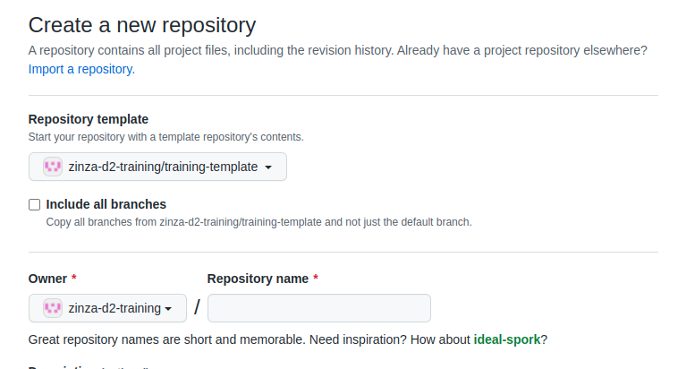
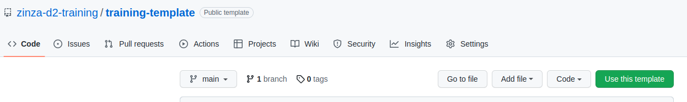

Đây là  template mẫu dùng cho [zinza-training](https://github.com/zinza-d2-training/zinza-training) tool

Khi tạo template mới thì chọn tạo từ public template [training-template](https://github.com/zinza-d2-training/training-template)

Hoặc tại [training-template](https://github.com/zinza-d2-training/training-template) chọn `Use this template`

# Config

Mỗi template chứa file config [training-template.json](training-template.json). Cách nhanh nhất là chỉnh sửa trực tiếp bằng editor của github.

- `name`: Tên template để hiển thị trên trang https://zinza-training.vercel.app/
- `lang`: Ngôn ngữ dùng cho template này (vd: react, vue, angular, nestjs,...) để phục vụ cho filter
- `description`: Thông tin thêm về template
- `wbsLink`: Link tới training plan (excel) để phục vụ cho việc export reporting (WIP)
- `issuesOrder`: Config các issues và thứ tự issues để generate repository. Bạn có thể disable 1 vài issues không mong muốn chẳng hạn
- `cloneableFeatures`: Các features sẽ clone: `issues` | `milestones` | `tags`
- `cloneable`: Enable/Disable template
- `version`: Config version. Hiện tại chỉ có version 1
